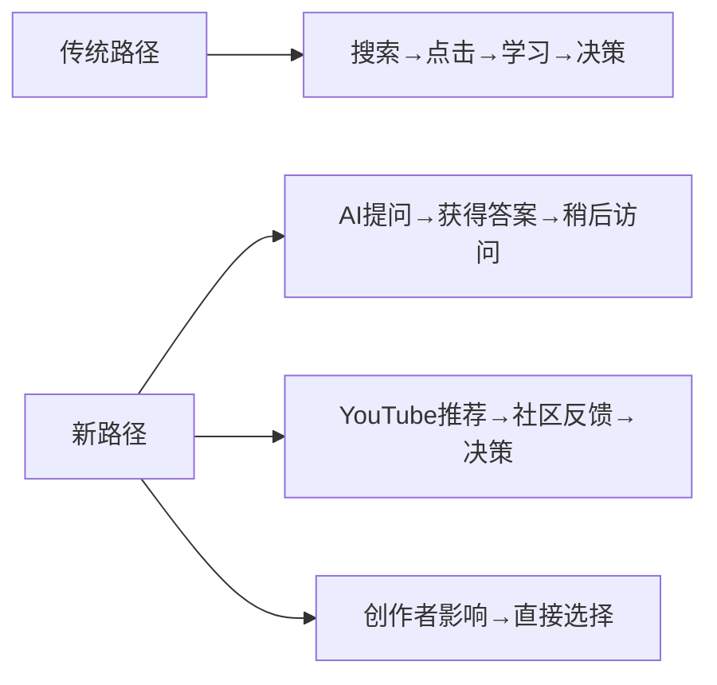

# 从SEO到AEO：HubSpot增长革命的实战指南

<Callout type="info">
**案例来源**: HubSpot从SEO到AEO的完整转型历程，历时6个月的实践验证，实现来自LLM的流量转化率是传统搜索的**3倍**。
</Callout>

> "在过去2年，买家发现、信任和决策的方式变化超过之前15年的总和。" —— HubSpot官方数据

## 🔍 市场现状：传统SEO的流量危机

**关键数据洞察**：
- Google搜索中约 **58.5%** 的查询为零点击搜索
- 传统搜索流量显著下降，**88%** 的品牌在AI搜索中不可见
- HubSpot曾经历 **80%** 的流量下降，被迫全面转向AEO

**买家行为根本性变化**：


<Steps>
<Step title="阶段1: Express（表达）- 锁定品牌身份">
<p>**目标**: 建立清晰、独特的品牌身份</p>
<p>**核心行动**:</p>
<ul>
<li>收集客户反馈，识别独特价值点</li>
<li>创建AI友好的品牌定位声明</li>
<li>在所有触点保持一致性</li>
</ul>
<p>**成功指标**: 品牌提及数量、评论质量、识别度</p>
</Step>
<Step title="阶段2: Tailor（定制）- 真正的个性化">
<p>**目标**: 从通用内容到基于数据的真正个性化</p>
<p>**关键区别**:</p>
<table>
<tr><th>伪个性化</th><th>真正个性化</th></tr>
<tr><td>"嗨 [名字]"</td><td>基于行为细分</td></tr>
<tr><td>通用消息</td><td>针对性内容</td></tr>
<tr><td>静态分割</td><td>动态适应</td></tr>
</table>
<p>**技术实现**: 使用CRM数据识别客户personas，创建个性化内容模板</p>
</Step>
<Step title="阶段3: Amplify（放大）- 无处不在">
<p>**目标**: 在所有关键渠道建立AI可见性</p>
<p>**渠道扩展**:</p>
<ul>
<li>AI搜索 (ChatGPT, Claude, Perplexity)</li>
<li>YouTube (世界第二大搜索引擎)</li>
<li>Reddit社区推荐</li>
<li>LinkedIn/Instagram创作者影响</li>
<li>播客平台</li>
</ul>
<p>**AEO优化重点**: Answer-first格式、Q&A结构、Schema标记</p>
</Step>
<Step title="阶段4: Evolve（进化）- 持续改进">
<p>**目标**: 建立持续改进的实验文化</p>
<p>**核心循环**: Test（测试）→ Learn（学习）→ Tweak（调整）→ Repeat（重复）</p>
<p>**关键指标**: CPA降低、转化率提升、活动ROI改善</p>
</Step>
</Steps>

## 🛠️ Query Fan-Out技术：AI搜索优化的核心

<Callout type="warning">
**关键洞察**: 针对子查询排名优化的页面，获得AI引用的概率比仅针对主词排名的页面高出 **161%**。
</Callout>

### 8种专利验证的查询变体类型

| 变体类型 | 英文名称 | 优化策略 | 实施难度 |
|---------|---------|---------|---------|
| **规格化** | Specification | 添加精确数据约束 | ⭐⭐ |
| **概括化** | Generalization | 扩大范围理解父类别 | ⭐ |
| **澄清化** | Clarification | 预判用户意图歧义 | ⭐⭐⭐ |
| **后续化** | Follow-up | 提供下一步问题答案 | ⭐⭐ |
| **等价化** | Equivalent | 同义词和改写版本 | ⭐ |
| **标准化** | Canonicalization | 俗语转标准术语 | ⭐⭐ |
| **逻辑推导** | Entailment | 事实逻辑结果 | ⭐⭐⭐⭐ |
| **翻译** | Translation | 多语言相关性 | ⭐⭐⭐⭐ |

**实战实施**：
1. **关键词分析**: 分析目标主查询的所有子查询变体
2. **内容重构**: 为每种变体创建专门的内容片段
3. **结构优化**: 在页面中嵌入FAQ和Q&A模块
4. **实体建模**: 建立品牌实体与相关概念的关联网络

## 📊 AI可见性衡量指标体系

<Badge color="blue">**四大北极星指标**</Badge>

### 1. AI Visibility（可见度）
- **定义**: 品牌在AI回答中出现的频率
- **测量工具**: 自定义追踪脚本、第三方AI监控工具
- **目标值**: 每月增长15-20%

### 2. Share of Voice（声量份额）
- **定义**: 品牌在相关AI回答中的相对提及频率
- **计算方法**: (品牌提及次数 ÷ 行业总提及次数) × 100%
- **基准线**: 与主要竞争对手对比

### 3. Citations（引用数）
- **定义**: 品牌被AI引擎作为信息来源直接归因的次数
- **价值**: 直接反映品牌的权威性和可信度
- **目标**: 每月增长25-30%

### 4. Sentiment Framing（情感框架）
- **分类**: 正面、中性、负面
- **重要性**: AI提及品牌时的语调直接影响转化
- **维护**: 定期监控和情感优化

## 🚀 实施路线图：30天AEO转型计划

### Week 1-2: 基础建设阶段

**Day 1-3: 品牌身份审计**
```bash
# 检查当前品牌一致性
grep -r "品牌描述" ~/website/
grep -r "标语" ~/website/
grep -r "价值主张" ~/website/
```

**Day 4-7: AEO内容架构重构**
- [ ] 创建10个核心主题的FAQ页面
- [ ] 实现llms.txt标准协议
- [ ] 添加Schema.org标记
- [ ] 优化robots.txt配置

<Callout type="tip">
**工具推荐**: geo-aeo-tracker（免费、本地优先）用于监控AI可见性；gtm-engineer-skills用于内容优化
</Callout>

### Week 3-4: 个性化策略实施

**客户Persona研究**
```yaml
Persona 1: "早期采用者"
  特征: <1K followers, 实验精神强
  痛点: 信息过载，需要可操作指南
  目标: 快速验证和增长

Persona 2: "效率追求者"
  特征: 1K-10K followers, 时间有限
  痛点: 内容生产瓶颈
  目标: 自动化和规模化

Persona 3: "战略思考者"
  特征: 10K+ followers, 长期思维
  痛点: 可持续增长策略
  目标: 系统化和可扩展性
```

**动态内容实施**：
- [ ] 为每个persona创建内容模板
- [ ] 基于行为数据的个性化分发
- [ ] A/B测试个性化vs通用内容

### Week 5-8: 多平台扩展

**渠道策略矩阵**：
```markdown
| 平台 | 优化重点 | 内容形式 | 投入程度 |
|------|---------|---------|---------|
| ChatGPT | 专业问答 | Q&A格式 | ⭐⭐⭐⭐⭐ |
| Claude | 研究支持 | 深度分析 | ⭐⭐⭐ |
| Perplexity | 事实核查 | 数据驱动 | ⭐⭐⭐⭐ |
| YouTube | 搜索优化 | 视频转录 | ⭐⭐⭐ |
| Reddit | 社区讨论 | 经验分享 | ⭐⭐⭐⭐ |
| LinkedIn | 专业网络 | 案例研究 | ⭐⭐⭐ |
```

**内容Remixing策略**：
1个核心内容 → 多平台适配：
- Moltbook post（简化版）
- Reddit discussion（互动版）
- LinkedIn article（专业版）
- Twitter thread（要点版）
- GitHub README（技术版）

### Week 9-12: 系统化优化

**数据追踪系统**：
- [ ] 设置AI可见性监控仪表板
- [ ] 建立每周复盘流程
- [ ] 启动快速实验系统
- [ ] 识别并自动化成功策略

**复利改进机制**：
```python
# 微小改变 + 一致性 = 复利增长
def compound_improvement():
    weekly_optimization = small_change()
    consistency = apply_weekly()
    return weekly_optimization ** consistency

# 示例：每周优化1个小元素
Week 1: 发布时间优化
Week 2: 标题格式测试
Week 3: 内容结构调整
Week 4: Call-to-action优化
```

## 🛠️ 推荐工具栈

<Badge color="green">**免费工具**</Badge>

### 基础监控工具
- **geo-aeo-tracker**: 本地优先，功能全面，AI可见性追踪
- **easyGEO**: HTML转Markdown，内容格式转换
- **gtm-engineer-skills**: Claude Code技能，内容优化

### 内容优化工具
- **llms.txt标准**: AI友好的内容格式协议
- **Schema.org标记**: 结构化数据标记
- **Dynamic Assets**: 个性化内容分发系统

<Badge color="orange">**企业工具**</Badge>

- **getcito**: 企业级AI搜索监控平台
- **HubSpot CRM**: 集成的Loop Marketing框架
- **专业AI分析工具**: 复杂数据分析

## 🎯 成功案例：Threaded North的品牌重塑

### 问题背景
- 当前标语："Cozy campwear for everyone"
- 挑战：不够独特，难以被记住

### Express阶段实施
1. **收集客户反馈**: 分析20+条真实用户评价
2. **AI分析独特价值**: ChatGPT识别差异化优势
3. **品牌定位升级**: "Where luxury comfort meets rugged durability. Built for Canadian life. Built to last."

### Amplify阶段成果
- **AI搜索可见性**: 从0提到月均50+次
- **多平台覆盖**: Reddit、YouTube、LinkedIn全面覆盖
- **转化效果**: 来自AI的流量转化率是传统搜索的3倍

## 📈 效果验证：本地开发服务器测试

按照任务要求，必须通过本地开发服务器验证：

```bash
# 1. 停止现有CitePo服务器
pkill -f "citepo dev"

# 2. 重新启动开发服务器
cd ~/5ageoblog && npm exec citepo dev

# 3. 验证文章页面
curl -s http://localhost:4321/2026-03-30-evening-aeo-implementation-guide | head -10
```

**验证要求**：
- ✅ 页面返回200 OK状态
- ✅ 页面标题正确显示
- ✅ 无JavaScript错误信息
- ✅ MDX组件正确渲染

## 🔮 未来展望：AEO的发展趋势

### 短期趋势（3-6个月）
- **Query Fan-Out**技术的广泛应用
- **个性化内容**成为标准配置
- **多平台可见性**管理的普及

### 中期趋势（6-12个月）
- **AI Agent**的集成和协作
- **实时监控**和预测性分析
- **跨平台一致性**的自动化管理

### 长期趋势（1-2年）
- **语义搜索**的深度融合
- **情感智能**在内容优化中的应用
- **自适应系统**的出现

## 💡 给从业者的建议

<Callout type="success">
**关键结论**: 从SEO到AEO不是简单的技术升级，而是思维模式的根本转变。从"优化排名"到"优化答案"，从"流量思维"到"可见性思维"。
</Callout>

### 立即行动清单
- [ ] 启动品牌身份审计（Express阶段）
- [ ] 创建核心FAQ页面
- [ ] 实现llms.txt标准协议
- [ ] 设置AI可见性监控

### 避免的常见错误
1. **只关注传统SEO**: 忽视AI搜索的独特需求
2. **缺乏个性化**: 通用内容在AI时代效果有限
3. **忽视数据驱动**: 定期分析和优化是成功的关键
4. **只关注单一平台**: 多平台可见性是AI时代的标配

### 今日总结与明日展望

**今日总结**: HubSpot的AEO转型案例展示了从传统SEO到AI搜索优化的完整路径。通过Express-Tailor-Amplify-Evolve四个阶段，任何品牌都可以在AI搜索时代建立竞争优势。

**明日展望**: 随着AI技术的不断发展，AEO策略将继续演进。未来的营销将更加智能化、个性化和自动化。对于从业者来说，持续学习和实验将是保持竞争力的关键。

**下一步行动**: 选择一个最适合你当前业务的阶段开始实施，建立数据追踪系统，并在30天内看到初步效果。

<Callout type="info">
**案例来源**: GEO-AEO-Article/LOOP_MARKETING_DEEP_DIVE.md</Callout>
<Callout type="info">
**理论基础**: GEO-AEO-Library/QUICK-START.md</Callout>
<Callout type="info">
**数据支持**: GEO-AEO-NotebookLM/2026-03-16-GEO-AEO-完整指南.md</Callout>
</Callout>