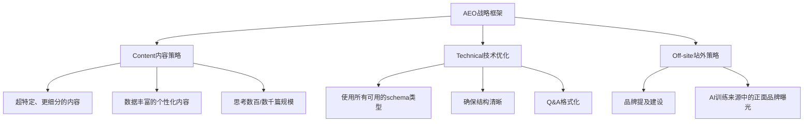

# 2026年GEO/AEO战略：从SEO到AI搜索的完整转型指南

<Callout type="info">
  <strong>导读</strong>：2026年传统SEO流量骤降80%，GEO/AEO成为企业数字化转型的关键路径。本文基于HubSpot成功转型案例和最新市场数据，为从业者提供完整行动框架。
</Callout>

## 流量危机：传统SEO的时代终结

互联网正在经历前所未有的范式转变——从"链接时代"彻底转向"回答时代"。这个转变不是渐进式的，而是**革命性的颠覆**。

### 关键数据警示

<Badge color="red">流量危机</Badge>
Google搜索中约**58.5%**的查询已经为零点击搜索，这意味着超过一半的用户不再点击传统链接。

<Badge color="yellow">市场觉醒</Badge>
HubSpot曾经历**80%**的流量断崖式下降，这次危机迫使这个曾经的SEO霸主彻底重新思考内容策略。

<Badge color="blue">市场格局</Badge>
**88%**的品牌在AI搜索中完全不可见，即使它们在传统搜索中排名靠前。

这是否意味着传统SEO已经死亡？不是。SEO正在进化，但需要全新的思维模式和策略框架。

## GEO vs SEO：本质差异解析

### SEO（搜索引擎优化）

**核心目标**：提高网页在搜索结果页(SERP)中的排名

**运作机制**：
- 关键词匹配驱动点击率(CTR)
- 反向链接建设
- 技术优化与元数据调整

**成功标准**：关键词排名、自然流量、点击率

### AEO/GEO（回答/生成式引擎优化）

**核心目标**：使品牌内容成为AI综合回答的一部分

**运作机制**：
- 优化内容结构和语义清晰度
- 建立品牌实体权威性
- 优化AI引用和提及机会

**成功标准**：
- 品牌在AI回答中的出现频率(VISIBILITY)
- 被AI引用的次数(CITATIONS)
- 品牌提及频次(MENTIONS)

## HubSpot的成功转型：AEO战略框架

HubSpot的转型案例为行业提供了宝贵的实战参考。他们在AI时代经历了**从SEO到AEO的完整蜕变**。

### 三大战略支柱



### 内容策略的彻底转变

| SEO时代 | AEO时代 |
|---------|---------|
| 宏观主题覆盖 | **超特定、更细分、更深的内容** |
| Ultimate Guide系列 | **针对特定用例和角色** |
| 月产30篇 | **思考数百/数千篇规模** |
| 宽泛关键词策略 | **语义实体建模** |

### 四大北极星指标体系

<Badge color="blue">1. VISIBILITY (可见度)</Badge>
品牌在AI回答中的出现频率，这是最重要的指标，直接驱动最终转化。

<Badge color="green">2. SHARE OF VOICE (声量份额)</Badge>
相对于竞争对手的可见度，用于抵消算法变化的影响。

<Badge color="yellow">3. MENTIONS (提及次数)</Badge>
品牌被提及的频率，包含在Visibility指标中。

<Badge color="red">4. CITATIONS (引用次数)</Badge>
网站作为答案来源被引用的次数，有引用→更好的排名和情感。

## GEO技术实施路线图

### 第一阶段：基础架构

#### 1. 实现LLM协议

在网站根目录创建`/llms.txt`文件：

```yaml
---
title: Your Website Name
version: 1.0
updated: 2026-03-31
---

## Documentation
- Getting Started: /docs/getting-started
- API Reference: /docs/api
- Examples: /docs/examples

## Data
- Dataset: /dataset
- Model Weights: /models
```

#### 2. Schema.org标记优化

确保所有内容都有正确的结构化数据标记，特别是：
- 如何标记(HOWTO)
- FAQ页面
- 文章内容
- 组织信息

<Callout type="tip">
  **提示**：使用JSON-LD格式，AI爬虫更容易理解和解析。
</Callout>

#### 3. AI友好的robots.txt

```txt
User-agent: GPTBot
User-agent: ChatGPT-User
User-agent: Crawler
User-agent: anthropic-ai
Allow: /

# 禁止低质量内容
Disallow: /temp/
Disallow: /draft/
```

### 第二阶段：内容优化

#### 1. 语义清晰度

- 使用清晰、准确的专业术语
- 避免模糊不清的表达
- 建立内部实体关系图

#### 2. 实体建模

识别和定义你的核心业务实体，包括：
- 产品实体
- 服务实体
- 概念实体
- 人物实体

#### 3. 对话设计

将传统文章重新设计为对话格式：
- 针对常见问题回答
- 提供多角度解决方案
- 包含实例和案例

<AccordionGroup>
  <Accordion title="如何开始GEO内容转型？">
    <strong>第一步</strong>：审计现有内容，识别可转化为AEO格式的高价值页面。
    <strong>第二步</strong>：重新组织内容架构，建立语义主题集群。
    <strong>第三步</strong>：添加结构化数据和LLM协议支持。
  </Accordion>
  <Accordion title="GEO需要多长时间见效？">
    根据HubSpot的经验，完整的GEO转型通常需要3-6个月才能看到显著效果。
    前期是基础设施建设，中期是内容优化，后期才是效果显现。
  </Accordion>
</AccordionGroup>

## 2026年GEO市场趋势分析

### 全球与中国市场分化

<Badge color="blue">美国市场</Badge>
以ChatGPT为主导，占AI推荐流量的87.4%，引用来源以Wikipedia为主(47.9%)。

<Badge color="green">中国市场</Badge>
以百度文心一言、阿里通义千问为主，本土化内容需求强烈。

<Badge color="yellow">跨境机会</Badge>
出海企业面临"同一战争，不同战场"的挑战，需要针对不同市场制定差异化策略。

### 技术演进趋势

#### 1. Query Fan-Out（查询扇出）

> 一个查询如何变成多个子查询的技术

**核心机制**：
- 主查询触发多个相关子查询
- AI模型进行多轮信息收集
- 综合所有子查询结果生成最终答案

**对SEO的影响**：
- 单页面的权重被分散到多个相关页面
- 主题集群的重要性大幅提升
- 实体关联性成为关键因素

#### 2. AI智能体的崛起

以Manus为代表的AI智能体正在改变内容消费模式：
- 主动搜索而非被动接收
- 多轮对话式交互
- 个性化内容推荐

## 实战指南：GEO转型五步法

### 第一步：现状审计

<Steps>
  <Step>
    <strong>内容审计</strong>
    评估现有内容质量和结构，识别可优化页面。
  </Step>
  <Step>
    <strong>技术审计</strong>
    检查网站技术架构，识别GEO兼容性问题。
  </Step>
  <Step>
    <strong>竞品分析</strong>
    分析竞争对手在AI搜索中的表现，找出机会点。
  </Step>
</Steps>

### 第二步：战略制定

制定符合企业特点的GEO战略：
- 目标AI平台识别
- 核心实体定义
- 内容主题规划

### 第三步：内容转型

<Callout type="warning">
  **重要提醒**：不要一次性抛弃所有SEO内容，而是渐进式转型。
</Callout>

- 优先改造高流量、高价值页面
- 建立GEO内容模板和标准
- 创建新的GEO专属内容

### 第四步：技术实施

部署GEO必要的技术组件：
- LLM协议支持
- Schema.org标记
- AI友好的网站结构
- 内容管理系统适配

### 第五步：效果监控

建立GEO效果监控体系：
- 品牌可见度追踪
- 引用频次监控
- 提及分析
- 转化率变化

## 常见误区与风险规避

### GEO认知误区

<Badge color="red">误区1</Badge>
"GEO就是SEO的另一种叫法"——GEO是基于信任和权威性，而非传统的关键词排名。

<Badge color="red">误区2</Badge>
"只要内容好，AI就会引用"——内容质量是基础，但还需要技术支持和结构优化。

<Badge color="red">误区3</Badge>
"GEO只需要技术优化"——技术和内容必须并重，缺一不可。

### 风险规避策略

#### 1. 过度依赖单一平台

**风险**：过度依赖ChatGPT等单一AI平台

**解决方案**：实施多平台GEO策略，覆盖多个AI搜索渠道

#### 2. 内容批量生产的陷阱

**风险**：批量生产低质量AI内容，损害品牌权威

**解决方案**：坚持高质量、原创性内容，建立品牌风格指南

#### 3. 忽视用户体验

**风险**：过度优化AI引用而忽视真实用户需求

**解决方案**：平衡AI优化和用户体验，确保内容对真实用户有价值

## 总结：拥抱AI搜索时代

GEO/AEO不是SEO的终结，而是进化的开始。在这个新的搜索时代，成功的关键在于：

1. **思维转变**：从"排名思维"转向"信任思维"
2. **战略调整**：从"关键词驱动"转向"实体权威"
3. **技术适配**：从"SEO技术"转向"AI友好架构"
4. **内容升级**：从"链接页面"转向"综合答案"

正如HubSpot所证明的，即使在面临80%流量下降的危机时，通过正确的AEO战略转型，企业依然可以在AI时代获得成功。

记住：GEO是一场马拉松，不是短跑。需要耐心、坚持和持续优化，但回报将是巨大的——在AI搜索时代建立真正的品牌权威和可见性。

---

**参考来源**：
- [HubSpot AEO转型案例](https://blog.hubspot.com/marketing/ai-search-visibility)
- [GEO完整指南 - krillinai](https://github.com/krillinai/GEO)
- [llms.txt协议标准](https://github.com/AnswerDotAI/llms.txt)
- [中国GEO行业市场发展报告2026](https://mp.weixin.qq.com/中国GEO行业市场发展报告2026.pdf)

---

**标签**：`#GEO` `#AEO` `#AI搜索` `#转型策略` `#HubSpot案例`

{/*
⚠️ 写作规范检查清单：
- [ ] 没有使用 import 语句
- [ ] Badge 使用 color 属性（不是 variant 或 type）
- [ ] Accordion 使用 AccordionGroup + Accordion 结构
- [ ] 本地预览：npx citepo dev
- [ ] 构建测试：npx citepo build

详见：~/5ageoblog/MDX-WRITING-GUIDE.md
*/}