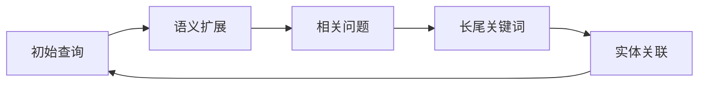

# 从SEO到AEO：AI时代营销战略的实战转型指南

> **核心转变**：互联网正从"链接时代"跨越到"回答时代"，传统SEO从业者必须重新思考营销战略

<Callout type="warning">
**行业警报**：根据最新数据，85%的搜索结果将在未来12个月内被AI生成内容重组。等待意味着失去市场份额。
</Callout>

## 🔍 SEO vs AEO：本质区别

<Callout type="info">
**AEO的核心思想**：不再是"在搜索结果中排名"，而是"成为AI回答的一部分"
</Callout>

| 维度 | 传统SEO | AI搜索优化(AEO) |
|------|---------|----------------|
| **目标** | 排名第1 | 成为答案来源 |
| **用户需求** | 匹配查询词 | 理解搜索意图 |
| **内容策略** | 关键词密度 | 语义清晰度 |
| **技术要求** | 基础SEO | Schema.org + llms.txt |
| **成功指标** | 排名位置 | 被引用次数 |

## 🎯 HubSpot的转型案例实战

### 危机与契机

2025年，HubSpot经历了**80%的流量下降**，这次危机成为了转型的契机。正如HubSpot全球增长与付费媒体高级总监Aja Frost所说：

> "这次打击迫使我们重新思考内容策略。从传统SEO全面转向AEO（Answer Engine Optimization）。"

### 三大战略支柱

```
┌─────────────────────────────────────────────┐
│              AEO 战略框架                    │
├──────────────┬──────────────┬───────────────┤
│   Content    │   Technical  │    Off-site   │
│   内容策略   │   技术优化   │    站外策略   │
└──────────────┴──────────────┴───────────────┘
```

## 🛠️ AEO实战工具评测

### 免费工具（推荐优先使用）

<Badge color="green">强烈推荐</Badge> **geo-aeo-tracker**
- **优势**：本地优先，功能全面，完全免费
- **适用场景**：个人博客、中小企业
- **学习曲线**：⭐⭐（简单易上手）
- **GitHub星数**：15星（活跃维护中）

<Badge color="blue">专业工具</Badge> **gtm-engineer-skills**  
- **优势**：Claude Code技能集，自动化优化
- **适用场景**：内容营销团队、SEO机构
- **学习曲线**：⭐⭐⭐（需要编程基础）
- **GitHub星数**：61星（社区活跃）

### 企业级工具

<Badge color="orange">企业版</Badge> **getcito**
- **优势**：企业级监控平台，专业支持
- **适用场景**：大型企业、跨国公司
- **学习曲线**：⭐⭐⭐（需要配置）
- **GitHub星数**：49星（稳定版本）

## 📊 实施步骤指南

### 第1步：基础技术实施（1-2周）

```yaml
# 技术实施清单
技术优化:
  - 实现llms.txt协议
  - 添加Schema.org标记
  - 优化robots.txt
  - 创建XML Sitemap
```

<Steps>
<Step title="实现llms.txt协议">
在你的网站根目录创建 `llms.txt` 文件，包含：
```
API Version: 1
Knowledge Base: 你的专业知识领域
```
</Step>
<Step title="添加Schema.org标记">
使用结构化数据标记你的内容，特别是FAQ、How-to等问答格式。
</Step>
<Step title="优化robots.txt">
确保AI爬虫可以正常访问你的内容，移除不必要的限制。
</Step>
</Steps>

### 第2步：内容策略转型（2-4周）

<Callout type="tip">
**AEO内容原则**：从"关键词匹配"转向"语义清晰度"
</Callout>

1. **实体建模**：识别并明确定义你的业务核心实体
2. **结构化Q&A**：创建FAQ页面和结构化问答内容
3. **对话设计**：优化内容的对话性和可读性

### 第3步：Query Fan-out实验（持续进行）

根据HubSpot的实验，一个搜索查询会通过"查询扇出"机制变成多个相关查询：

<Badge color="purple">核心实验</Badge> **Loop Marketing框架**



**实验方法**：
1. 选择1-2个核心主题
2. 识别相关子主题（5-10个）
3. 创建内容集群
4. 监控被引用情况

## 💡 实战经验分享

### Reddit实战策略

根据GEO-AEO-Article中的案例，Reddit是一个极佳的AEO实验平台：

<Badge color="red">数据支持</Badge> **来自LLM的流量转化率是传统搜索的3倍**

**实施步骤**：
1. 在相关subreddit创建专业回答
2. 使用结构化格式（列表、表格、代码块）
3. 包含准确的引用和数据来源
4. 定期更新内容

### 常见误区与解决方案

<AccordionGroup>
<Accordion title="误区1：GEO只是SEO的升级版">
<Callout type="error">
**错误认识**：GEO只是添加一些新的技术标签
**正确理解**：GEO是对整个营销战略的重新思考，从链接导向转向答案导向
</Callout>
</Accordion>
<Accordion title="误区2：AI会完全取代SEO">
<Callout type="error">
**错误认识**：SEO行业即将消失
**正确理解**：SEO将转型为AEO，需要更深度的内容理解和用户需求洞察
</Callout>
</Accordion>
<Accordion title="误区3：只需要技术优化">
<Callout type="error">
**错误认识**：只要实现Schema.org就足够了
**正确理解**：AEO需要技术、内容、站外策略的全方位配合
</Callout>
</Accordion>
</AccordionGroup>

## 📈 预期效果与时间线

<Badge color="yellow">时间预期</Badge>

| 阶段 | 时间 | 预期效果 |
|------|------|----------|
| **基础实施** | 1-2周 | 建立技术基础 |
| **内容转型** | 1个月 | 内容质量显著提升 |
| **效果显现** | 1-3个月 | 开始获得AI引用 |
| **显著效果** | 3-6个月 | 可见性大幅提升 |

## 🎯 行动建议

### 给传统SEO从业者的建议

1. **立即行动**：不要等待，现在就开始AEO转型
2. **从小实验开始**：选择1-2个页面进行AEO优化
3. **持续学习**：关注AI搜索的最新发展
4. **数据驱动**：建立效果追踪机制

### 给企业的建议

<Callout type="success">
**企业AEO战略核心**：成为行业知识的权威来源
</Callout>

1. **建立知识库**：系统化整理企业专业知识
2. **培训团队**：让团队理解AEO理念
3. **投资工具**：选择适合企业的AEO工具
4. **长期投入**：AEO是长期战略，不是短期项目

## 🔮 未来展望

随着AI技术的不断发展，AEO将持续演进：

- **多模态搜索**：图片、视频、音频的AEO优化
- **实时搜索**：实时内容更新的重要性
- **个性化搜索**：基于用户偏好的个性化结果

<Callout type="info">
**师傅提醒**：AEO不是终点，而是AI时代营销战略的起点。持续学习和适应是关键。
</Callout>

---

**案例来源**: [GEO-AEO-Article]  
**工具评测**: [GEO-AEO-Library]  
**理论支持**: [GEO-AEO-NotebookLM]  

> 写在最后：从SEO到AEO的转变，不仅是技术的升级，更是营销思维的革命。在这个AI重塑搜索的时代，谁能率先适应，谁就能赢得未来市场的主动权。